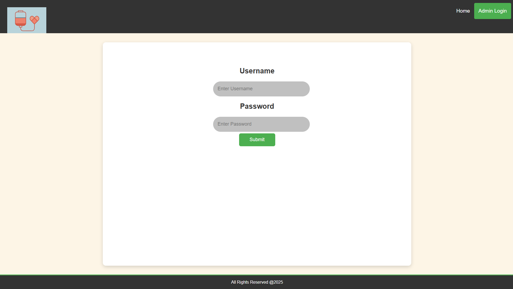
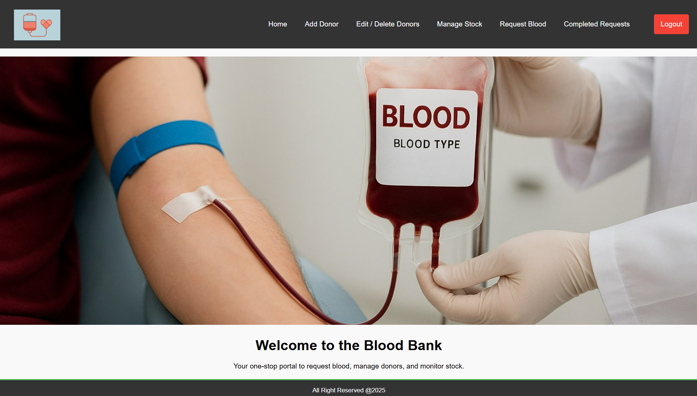
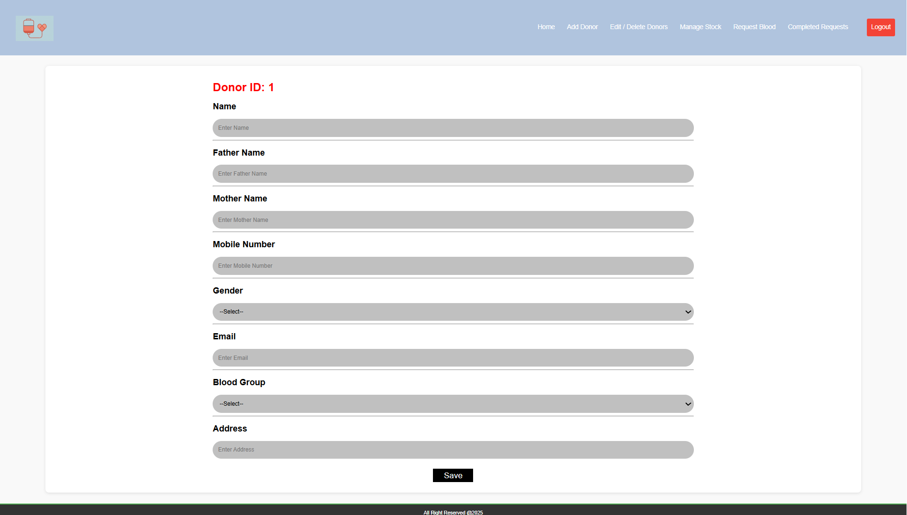
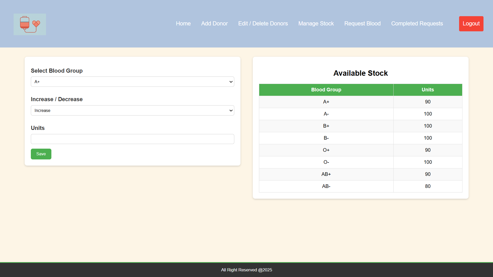
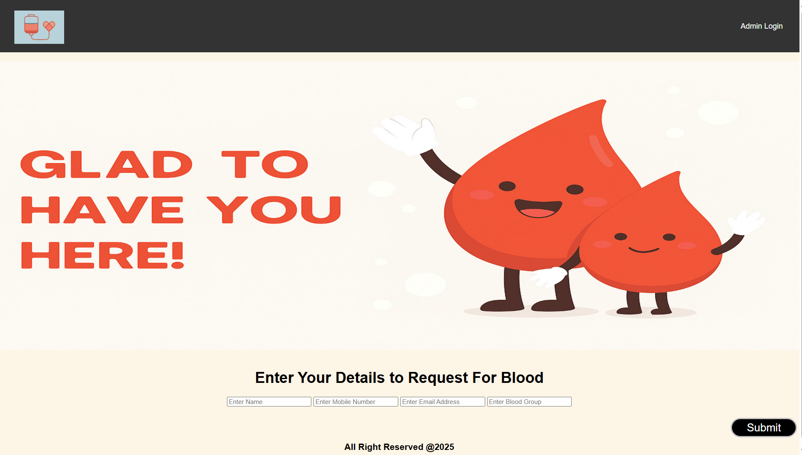

# 🩸 Blood Bank Management System (JSP + JDBC + MySQL)

A simple and functional blood bank management web application built using JSP, JDBC, and MySQL. No `web.xml` is required for this project since it uses pure JSP pages with direct actions inside `.jsp` files (no servlet mappings). The project runs on Apache Tomcat and is suitable for college projects or scalable improvements.

---

## 📦 Tech Stack
- **Frontend**: HTML, CSS, JSP  
- **Backend**: JSP (with embedded JDBC logic)  
- **Database**: MySQL 8.0 CE  
- **Server**: Apache Tomcat 9.0.102  
- **IDE**: Eclipse IDE for Enterprise Java and Web Developers (2025-06)  
- **Database Driver**: MySQL Connector/J 9.4.0 (JAR file in `WEB-INF/lib`)  

---

## 📂 Project Structure
Blood_Bank_Management_System/
├── src/main/webapp/
│ ├── META-INF/
│ ├── WEB-INF/
│ │ └── lib/mysql-connector-j-9.4.0.jar
│ ├── addNewDonor.jsp
│ ├── ... (other JSP files)
│ └── style.css, images
├── screenshots/
├── README.md
└── LICENSE

sql
Copy
Edit


## 🔧 Creating Dynamic Web Project in Eclipse  

Since this is a JSP + JDBC based project, it must be created as a **Dynamic Web Project** in Eclipse EE.  

### Step-by-Step Instructions  

1. **Open Eclipse IDE for Enterprise Java and Web Developers**  
2. **Create New Project:**  
   - `File → New → Dynamic Web Project`  

3. **Enter project name:**  
Blood_Bank_Management_System


4. **Configure Project Settings:**  
- Target runtime: **Apache Tomcat v9.0** (configured separately)  
- Configuration: **Dynamic Web Module 3.x** (default)  

5. Click **Finish**  

6. **Setup Project Files:**  
- Copy all JSP/HTML/CSS files into **WebContent** (or `src/main/webapp` if using Maven)  
- Place `mysql-connector-j-9.4.0.jar` inside `WEB-INF/lib`  

7. **Deploy and Run:**  
- Right-click the project → `Run As → Run on Server` → Select **Tomcat v9**  

---

## ⚙️ Installation & Setup

### 1) Install Required Software
- Java JDK 17 or later  
- Eclipse IDE for Enterprise Java Developers (2025-06)  
- Apache Tomcat 9.0.102  
- MySQL Server 8.0 CE  
- MySQL Workbench 8.0 CE  
- MySQL Connector/J 9.4.0  

---

### 2) Steps to Install & Configure Tomcat in Eclipse EE
⚠️ Eclipse EE IDE does not come with Tomcat pre-installed. You must download Apache Tomcat separately.

1. **Download Tomcat**  
   - [Tomcat 9.0.102 Download](https://tomcat.apache.org/download-90.cgi)  

2. **Extract Tomcat**  
   - Extract the zip to:  
     ```
     C:\apache-tomcat-9.0.102\
     ```

3. **Configure Tomcat in Eclipse**  
   - Open Eclipse EE → `Window → Preferences → Server → Runtime Environments → Add`  
   - Choose **Apache Tomcat v9.0**  
   - Browse and select folder:  
     ```
     C:\apache-tomcat-9.0.102
     ```
   - Click **Finish**

4. **Add Project to Tomcat**  
   - Right-click your project → `Run As → Run on Server`  
   - Select **Tomcat 9** → Finish  

---

### 3) Setup MySQL Database
```
CREATE DATABASE bloodbank;
USE bloodbank;

CREATE TABLE bloodrequest (
    name VARCHAR(200),
    mobilenumber VARCHAR(10),
    email VARCHAR(200),
    bloodgroup VARCHAR(10),
    status VARCHAR(100)
);

CREATE TABLE donor (
    id INT AUTO_INCREMENT PRIMARY KEY,
    name VARCHAR(200),
    father VARCHAR(200),
    mother VARCHAR(200),
    mobilenumber VARCHAR(10),
    gender VARCHAR(50),
    email VARCHAR(200),
    bloodgroup VARCHAR(20),
    address VARCHAR(200)
);

CREATE TABLE stock (
    bloodgroup VARCHAR(10),
    units INT NOT NULL
);

INSERT INTO stock VALUES
('A+',100),('A-',100),('B+',100),('B-',100),
('O+',100),('O-',100),('AB+',100),('AB-',100);

CREATE TABLE admin (
    id INT AUTO_INCREMENT PRIMARY KEY,
    username VARCHAR(50),
    password VARCHAR(50)
);

INSERT INTO admin (username,password) VALUES ('admin','admin');

```


## 4️⃣ Configure Eclipse Project

### Import Existing Project
1. **Import project into Eclipse:**

File → Import → Existing Projects into Workspace

2. **Copy MySQL Connector JAR to:**
```bash
src/main/webapp/WEB-INF/lib/mysql-connector-j-9.4.0.jar 
```

3. **Example absolute path:**
C:\Users\KIIT\eclipse-workspace\Blood Bank Management System\src\main\webapp\WEB-INF\lib\mysql-connector-j-9.4.0.jar


### 5️⃣ Run the Project  

**Deploy and Start:**  
- Right-click project → `Run As → Run on Server`  

**Access Application:**  
- [http://localhost:9090/Blood_Bank_Management_System](http://localhost:9090/Blood_Bank_Management_System)  

**Default Admin Login:**  
Username: admin

Password: admin


---

## 🧩 How It Works (No web.xml)  
### Architecture Features
- Pure JSP-driven (embedded JDBC code)  
- No custom servlet classes or URL mappings  
- `ConnectionProvider.getCon()` handles DB connection  
- Each JSP handles its own **UI + DB logic** (e.g. `*_Action.jsp`)  
- For larger systems, MVC (Servlet + JSP + DAO) is recommended  

---

## 🔐 Main Modules  
### Core Functionality
- Admin Login (`adminLogin.jsp`)  
- Add Donor (`addNewDonor.jsp`)  
- Edit/Delete Donor (`editDeleteList.jsp`, `updateDonor.jsp`)  
- Manage Stock (`manageStock.jsp`)  
- Request Blood (`requestForBlood.jsp`)  
- Pending Requests (`requestPending.jsp`)  
- Completed Requests (`completedRequest.jsp`)  

---

## 📸 Screenshots  
Add your images in `/screenshots` and link them below:  

### Application Interface  

**Login Screen**  
  

**Admin Dashboard**  
  

**Donor Management**  
  

**Stock Management**  
  

**Blood Requests**  
  


---

## 🧪 Troubleshooting  
### Common Issues & Solutions  

| Issue                 | Solution                                                                 |
|-----------------------|---------------------------------------------------------------------------|
| **404 Not Found**     | Ensure file exists in `/webapp` and clean/restart server                 |
| **JDBC Driver not found** | Ensure `mysql-connector-j-9.4.0.jar` is in `WEB-INF/lib`               |
| **DB Connection failed**  | Verify DB credentials and MySQL service status                        |

---
 

---

